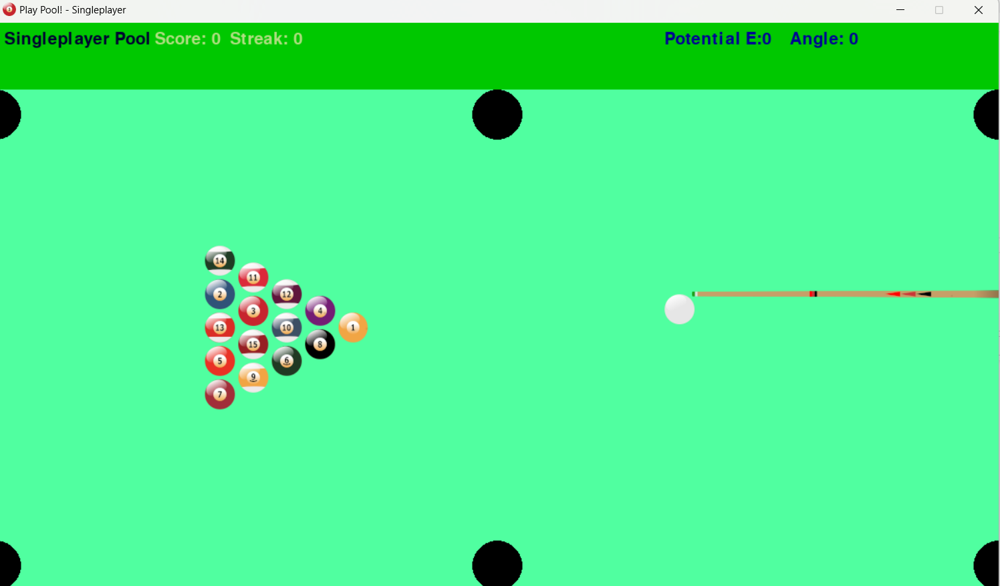

# pool-game
Pool / billiards game in python. This was done as a simple sphere collison physics experiment and was for me to practice said algorithms so it may not be the best to actually play as a game per se

Almost complete! 

TO ADD: Scoring, slightly tweak angle, fix collision detection

